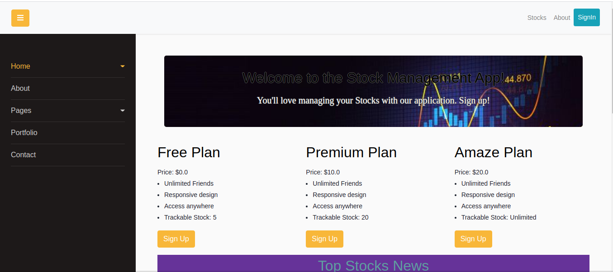

# Welcome to $ Finance Tracker $

Finance Tracker is a website that helps the stock trackers connect with others and exchange info related to stocks that they already added in their wishlist.

This is a website that allows a user to choose a plan based on the number of trackable stocks. User can search a stock based on ticker or name of the organization(eg: appl, fb). Connect with other users to know which stocks they are tracking at the moment. Recent news about the most added stocks by the users. Reliable payment method so subscribe a plan.
## Built With

- Ruby On Rails
- JavaScript
- HTML5
- SCSS
- Stripe
- Sendgrid
- Stock Quote
- Webpack

## Getting Started

- Clone the repository, in terminal execute
  ```
  git clone git@github.com:shshamim63/Finance-Tracker.git
  ```
- Enter into the repository
  ```
  cd Finance-Tracker
  ```
### Prerequisites
- Rails version: > 6.0.3
- Ruby version: 2.7.1
- PostgreSQL
- Srtipe account: Crete an account in [Stripe](https://stripe.com/). Then access your api key from the [developers dashboard](https://dashboard.stripe.com/test/apikeys). Collect both pulisable key and secret key.
- IEX Cloud account: Create an account in [IEX Cloud](https://iexcloud.io/). Collect the publishable key from your [tokens section](https://iexcloud.io/console/tokens)
- SendGrid accont: Create an account in [SendGrid](https://sendgrid.com/) and collect the [API Token](https://app.sendgrid.com/settings/api_keys)

### Setup

- If you are using vscode then execute the following line in the terminal.
  ```
  EDITOR="code --wait" rails credentials:edit
  ```
  This will open a file in your Vscode paste the following format at the end of the file. And fill it with the required token were copied.
  ```
  iex_token:
    stock_quote_api: PASTE IEX CLOUD API TOKEN

  sendgrid:
    sendgrid_user: apikey
    sendgrid_api_key: PASTE SendGrip API KEY

  stripe_key:
    PUBLISHABLE_KEY: PASTE STRIPE PUBLISHABLE KEY
    SECRET_KEY: PASTE STRIP SECRET KEY
  ```
  Close the open credential file and that will save the info. You can check [this](https://blog.saeloun.com/2019/10/10/rails-6-adds-support-for-multi-environment-credentials.html) link to know more about the environment credentials.
### Install
- Install all the gems and dependencies that are needed.
  ```
  bundle install
  yarn install
  ```
- Setup database
  ```
  rails db:setup
  ```
### Usage
Run the rails server and enjoy....
  ```
  rails s
  ```
## Authors

👤 **Author1**

- GitHub: [@shshamim63](https://github.com/shshamim63)
- LinkedIn: [LinkedIn](https://www.linkedin.com/in/shakhawathossainshamim/)

## 🤝 Contributing

Contributions, issues, and feature requests are welcome!

Feel free to check the [issues page](issues/).

## Show your support

Give a ⭐️ if you like this project!

## Acknowledgments

- Hat tip to anyone whose code was used
- Inspiration
- etc

## 📝 License

This project is [MIT](lic.url) licensed.